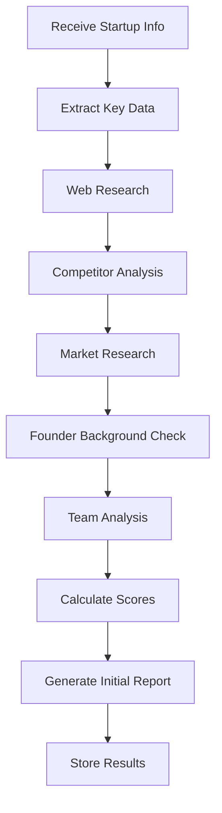
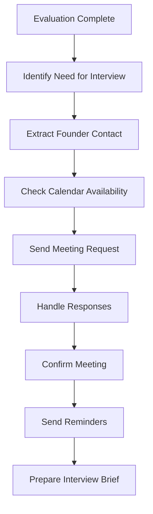
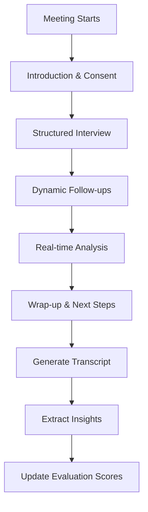

# High-Level Design: Startup Evaluation Platform

## System Architecture Overview

```
┌─────────────────────────────────────────────────────────────────┐
│                        Frontend Layer                           │
│  ┌─────────────────┐  ┌─────────────────┐  ┌─────────────────┐ │
│  │   Web Portal    │  │  Mobile App     │  │   Admin Panel   │ │
│  │   (React/Next)  │  │   (Flutter)     │  │    (React)      │ │
│  └─────────────────┘  └─────────────────┘  └─────────────────┘ │
└─────────────────────────────────────────────────────────────────┘
                                │
                                ▼
┌─────────────────────────────────────────────────────────────────┐
│                      API Gateway Layer                         │
│  ┌─────────────────────────────────────────────────────────────┐ │
│  │              Cloud Load Balancer + API Gateway             │ │
│  │                    (Authentication & Rate Limiting)        │ │
│  └─────────────────────────────────────────────────────────────┘ │
└─────────────────────────────────────────────────────────────────┘
                                │
                                ▼
┌─────────────────────────────────────────────────────────────────┐
│                    Vertex AI Agent Engine                      │
│  ┌─────────────────┐  ┌─────────────────┐  ┌─────────────────┐ │
│  │ Evaluation Agent│  │Scheduling Agent │  │Interview Agent  │ │
│  │                 │  │                 │  │                 │ │
│  │ • Research      │  │ • Calendar Mgmt │  │ • Voice AI      │ │
│  │ • Analysis      │  │ • Email/SMS     │  │ • NLP Analysis  │ │
│  │ • Scoring       │  │ • Availability  │  │ • Follow-up     │ │
│  └─────────────────┘  └─────────────────┘  └─────────────────┘ │
└─────────────────────────────────────────────────────────────────┘
                                │
                                ▼
┌─────────────────────────────────────────────────────────────────┐
│                    Backend Services Layer                      │
│  ┌─────────────────┐  ┌─────────────────┐  ┌─────────────────┐ │
│  │   Cloud Run     │  │ Cloud Functions │  │   App Engine    │ │
│  │                 │  │                 │  │                 │ │
│  │ • API Services  │  │ • Event Handlers│  │ • Web Services  │ │
│  │ • Business Logic│  │ • Integrations  │  │ • Background    │ │
│  │ • Orchestration │  │ • Notifications │  │   Jobs          │ │
│  └─────────────────┘  └─────────────────┘  └─────────────────┘ │
└─────────────────────────────────────────────────────────────────┘
                                │
                                ▼
┌─────────────────────────────────────────────────────────────────┐
│                      Data & Storage Layer                      │
│  ┌─────────────────┐  ┌─────────────────┐  ┌─────────────────┐ │
│  │   Firestore     │  │   Cloud SQL     │  │ Cloud Storage   │ │
│  │                 │  │                 │  │                 │ │
│  │ • Documents     │  │ • Structured    │  │ • Files         │ │
│  │ • Real-time     │  │   Data          │  │ • Documents     │ │
│  │ • NoSQL         │  │ • Analytics     │  │ • Media         │ │
│  └─────────────────┘  └─────────────────┘  └─────────────────┘ │
└─────────────────────────────────────────────────────────────────┘
                                │
                                ▼
┌─────────────────────────────────────────────────────────────────┐
│                    External Integrations                       │
│  ┌─────────────────┐  ┌─────────────────┐  ┌─────────────────┐ │
│  │   Web Scraping  │  │  Calendar APIs  │  │   Voice APIs    │ │
│  │                 │  │                 │  │                 │ │
│  │ • Company Info  │  │ • Google Cal    │  │ • Speech-to-Text│ │
│  │ • Market Data   │  │ • Outlook       │  │ • Text-to-Speech│ │
│  │ • News/Social   │  │ • Calendly      │  │ • Voice Synth   │ │
│  └─────────────────┘  └─────────────────┘  └─────────────────┘ │
└─────────────────────────────────────────────────────────────────┘
```

## Core Components

### 1. Vertex AI Agent Engine Configuration

#### Evaluation Agent
```yaml
Agent Type: Research & Analysis Agent
Capabilities:
  - Web scraping and data collection
  - Document analysis and processing
  - Competitive intelligence gathering
  - Market research automation
  - Scoring algorithm execution

Tools & Integrations:
  - Vertex AI Search & Conversation
  - Document AI for PDF processing
  - Natural Language API
  - Web Risk API
  - Custom research tools
```

#### Scheduling Agent
```yaml
Agent Type: Coordination & Communication Agent
Capabilities:
  - Calendar management
  - Email/SMS automation
  - Meeting scheduling optimization
  - Reminder systems
  - Availability matching

Tools & Integrations:
  - Google Calendar API
  - Gmail API
  - Twilio for SMS
  - Calendly integration
  - Zoom/Meet API
```

#### Interview Agent
```yaml
Agent Type: Conversational AI Agent
Capabilities:
  - Voice-based interviews
  - Real-time conversation analysis
  - Follow-up question generation
  - Sentiment analysis
  - Interview summarization

Tools & Integrations:
  - Speech-to-Text API
  - Text-to-Speech API
  - Dialogflow CX
  - Contact Center AI
  - Custom conversation models
```

### 2. Backend Services Architecture

#### API Services (Cloud Run)
```
┌─────────────────────────────────────────┐
│              API Gateway                │
│  ┌─────────────────────────────────────┐ │
│  │         Authentication              │ │
│  │    (Firebase Auth + IAM)           │ │
│  └─────────────────────────────────────┘ │
│                                         │
│  ┌─────────────────────────────────────┐ │
│  │         Rate Limiting               │ │
│  │      (Cloud Armor + Quotas)        │ │
│  └─────────────────────────────────────┘ │
│                                         │
│  ┌─────────────────────────────────────┐ │
│  │         Request Routing             │ │
│  │    (Load Balancer + Cloud Run)     │ │
│  └─────────────────────────────────────┘ │
└─────────────────────────────────────────┘
```

#### Microservices Structure
```
startup-evaluation-api/
├── evaluation-service/
│   ├── controllers/
│   ├── services/
│   ├── models/
│   └── utils/
├── scheduling-service/
├── interview-service/
├── document-service/
├── notification-service/
└── reporting-service/
```

### 3. Data Architecture

#### Firestore Collections
```javascript
// Startup evaluations
startups: {
  startupId: {
    basicInfo: {...},
    founderInfo: {...},
    evaluationScores: {
      founderMarketFit: 0-100,
      problemEvaluation: 0-100,
      uspEvaluation: 0-100,
      teamProfile: 0-100,
      overallScore: 0-100
    },
    evaluationHistory: [...],
    documents: [...],
    interviews: [...],
    status: "pending|in-progress|completed",
    createdAt: timestamp,
    updatedAt: timestamp
  }
}

// Investment memos
investmentMemos: {
  memoId: {
    startupId: string,
    executiveSummary: string,
    detailedAnalysis: {...},
    recommendations: [...],
    riskAssessment: {...},
    financialProjections: {...},
    generatedAt: timestamp
  }
}
```

#### Cloud SQL Schema
```sql
-- Structured data for analytics
CREATE TABLE evaluations (
    id UUID PRIMARY KEY,
    startup_id VARCHAR(255),
    evaluation_type VARCHAR(50),
    score DECIMAL(5,2),
    criteria JSONB,
    evaluator_agent VARCHAR(100),
    created_at TIMESTAMP,
    updated_at TIMESTAMP
);

CREATE TABLE interviews (
    id UUID PRIMARY KEY,
    startup_id VARCHAR(255),
    interview_type VARCHAR(50),
    transcript TEXT,
    analysis JSONB,
    sentiment_score DECIMAL(3,2),
    key_insights JSONB,
    conducted_at TIMESTAMP
);
```

## Agent Workflows

### 1. Evaluation Agent Workflow


### 2. Scheduling Agent Workflow


### 3. Interview Agent Workflow


## Deployment Architecture

### GCP Services Configuration

#### Vertex AI Agent Engine
```yaml
# Agent deployment configuration
agents:
  evaluation-agent:
    runtime: "vertex-ai-agent-runtime"
    model: "gemini-pro"
    tools:
      - web-search
      - document-processor
      - data-analyzer
    
  scheduling-agent:
    runtime: "vertex-ai-agent-runtime"
    model: "gemini-pro"
    tools:
      - calendar-integration
      - email-sender
      - sms-sender
    
  interview-agent:
    runtime: "vertex-ai-agent-runtime"
    model: "gemini-pro"
    tools:
      - speech-to-text
      - text-to-speech
      - conversation-analyzer
```

#### Infrastructure as Code (Terraform)
```hcl
# Main infrastructure components
resource "google_project" "startup_evaluation" {
  name       = "startup-evaluation-platform"
  project_id = "startup-eval-${random_id.project_suffix.hex}"
}

resource "google_vertex_ai_agent" "evaluation_agent" {
  display_name = "Startup Evaluation Agent"
  description  = "AI agent for comprehensive startup evaluation"
  # Configuration details...
}

resource "google_cloud_run_service" "api_service" {
  name     = "startup-evaluation-api"
  location = var.region
  # Service configuration...
}
```

## Security & Compliance

### Authentication & Authorization
- Firebase Authentication for user management
- IAM roles and policies for service-to-service communication
- API key management for external integrations
- OAuth 2.0 for third-party calendar/email access

### Data Protection
- Encryption at rest (Cloud KMS)
- Encryption in transit (TLS 1.3)
- PII data handling compliance
- GDPR/CCPA compliance measures
- Data retention policies

## Monitoring & Observability

### Logging & Monitoring
```yaml
Monitoring Stack:
  - Cloud Logging for centralized logs
  - Cloud Monitoring for metrics
  - Cloud Trace for distributed tracing
  - Error Reporting for error tracking
  - Cloud Profiler for performance analysis

Key Metrics:
  - Agent response times
  - Evaluation accuracy scores
  - API latency and throughput
  - User engagement metrics
  - System resource utilization
```

## Cost Optimization

### Resource Management
- Auto-scaling for Cloud Run services
- Scheduled scaling for batch processing
- Efficient Vertex AI model usage
- Storage lifecycle management
- Reserved capacity for predictable workloads

### Estimated Monthly Costs (USD)
```
Vertex AI Agent Engine: $500-2000
Cloud Run Services: $200-800
Cloud Storage: $50-200
Firestore: $100-500
Cloud SQL: $150-600
External APIs: $300-1000
Total Estimated: $1300-5100/month
```

## Implementation Phases

### Phase 1: Core Platform (Weeks 1-4)
- Basic infrastructure setup
- Evaluation agent development
- Simple web interface
- Document processing pipeline

### Phase 2: Enhanced Features (Weeks 5-8)
- Scheduling agent integration
- Advanced evaluation algorithms
- Reporting dashboard
- API documentation

### Phase 3: Interview Capabilities (Weeks 9-12)
- Interview agent development
- Voice processing integration
- Real-time analysis features
- Mobile application

### Phase 4: Production & Scale (Weeks 13-16)
- Performance optimization
- Security hardening
- Monitoring implementation
- User training and rollout
